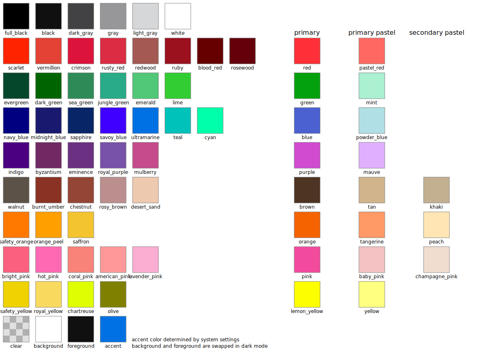

Making GUIs sucks, and I got tired of it. Either you're relying on stupid low-level APIs which are ancient, awful to work with and OS dependent, or you choose to use one of the 10000 ancient GUI libraries which all look like they were made for the 1980s (I'm looking at you, GTK), or you're using Electron, which means a. you're stuck with using HTML & node.js and b. you can say good bye to any performance to speak of.

And thus, CXXGUI was born. The goal was to make something **simple to use**, **powerful** and with great **cross-platform** support, without having to rely on different APIs for each system.

The cross-platform goal is what drove the decision of using OpenGL since it has the best cross-platform support (since Vulkan is still not natively supported on macOS and I wasn't going to make a special version in Metal just for macOS).

The end goal is to make something incredibly intuitive to work with, while remaining incredibly powerful. The syntax and design was somewhat inspired by [SwiftUI](https://developer.apple.com/xcode/swiftui/), while removing a lot of the limitations I encountered while messing around with SwiftUI.

# Documentation

Documentation coming in the future once the project has progressed farther.

## Colors

## Symbols

Each individual color of the symbols can be individually addressed by setting the rendering mode to palette.
There are currently few symbols, but more will be added as development continues.

# Notes for Linux users

Since Linux doesn't have a standardized system font across all distros, and since I am not going to use a different font library just to accomodate Linux users better, CXXGUI uses DejaVu Sans and DejaVu Sans Mono on Linux as default font (this is also the default font on Ubuntu), as such, you're going to have to install those two fonts if you don't have them.

Alternatively, I'd just reccomend downloading [SF Pro Text](https://devimages-cdn.apple.com/design/resources/download/SF-Pro.dmg) and [SF Mono](https://devimages-cdn.apple.com/design/resources/download/SF-Mono.dmg) from [Apple's Website](https://developer.apple.com/fonts/) as they are honestly better fonts, and come in all weights. They come in DMG images, which can easily be mounted on Linux and the fonts can then be extracted from the .pkg inside, which is a XAR archive, which then contains the .otf fonts.
